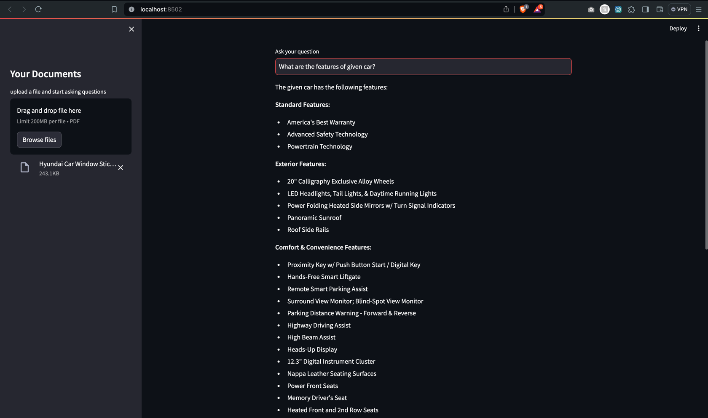

# OpenAIChatbot:
This is a user-friendly chatbot application powered by OpenAI's technology. It allows you to upload your own document, which it then analyzes to provide answers to your questions.

## Prerequisites:
Before running the application, make sure you have the following installed:

- Python (version 3.7 or later)
- Streamlit
- ngrok (optional, for making the app accessible via the internet)

## Installation:

1. Clone this repository:

    ```bash
    git clone https://github.com/Rabin-Shrestha/OpenAIChatbot.git
    ```

2. Navigate to the project directory:

    ```bash
    cd OpenAIChatbot
    ```

## Install dependency:

### Option 1: Install directly on your host Machine
Install the required Python packages:

```bash
    pip install -r requirements.txt
```
   
### Option2: Install dependency on the virtual Environment
To create a virtual environment (`venv`) and install packages from a `requirements.txt` file, you can follow these steps:
1. **Create the virtual environment**:
   First, navigate to the directory where you want to create the virtual environment. Then, run the following command to create the virtual environment:

   ```bash
   python -m venv myenv
   ```

   Replace `myenv` with the name you want to give to your virtual environment.
   Note: You can then add this virtual environment in the Pycharm interpreter setting to avoid any IDE error.

2. **Activate the virtual environment**:
   After creating the virtual environment, you need to activate it. The activation command varies depending on your operating system:

   - **Linux/macOS**:
     ```bash
     source myenv/bin/activate
     ```

   - **Windows**:
     ```bash
     myenv\Scripts\activate
     ```

   After activation, you should see `(myenv)` prefix in your terminal, indicating that the virtual environment is active.

3. **Install packages from `requirements.txt`**:
   Once the virtual environment is activated, you can install packages from the `requirements.txt` file using `pip`. Run the following command:

   ```bash
   pip install -r requirements.txt
   ```

   This command will install all the packages listed in the `requirements.txt` file into your virtual environment.

4. **Verify installation**:
   After installing the packages, you can verify that they are installed correctly by running `pip list` to see a list of installed packages in your virtual environment.

Now, your virtual environment is set up with the packages specified in the `requirements.txt` file. You can use this virtual environment for your Python project, and the installed packages will be isolated from the system-wide Python installation.


## Running the App:

To run the Python app using Streamlit, execute the following command:

```bash
streamlit run main.py
```

This command will start a local web server and open the app in your default web browser.

## Access your app from Internet:
If you want to make the app accessible via the internet, you can use ngrok. This allows you to expose your locally running application into the internet.  Follow these steps:

1. Download and install ngrok from https://ngrok.com/download.

2. After installing ngrok, navigate to the directory where ngrok is located.

3. Run the following command to expose the local web server:

    ```bash
    ./ngrok http 8501
    ```

   Replace `8501` with the port number used by Streamlit if it's different.

4. After running the command, ngrok will provide a public URL (e.g., http://abc123.ngrok.io) that you can use to access the app from anywhere.

   Note: The public URL provided by ngrok is temporary and may change every time you restart ngrok.

## Demo Chat:

